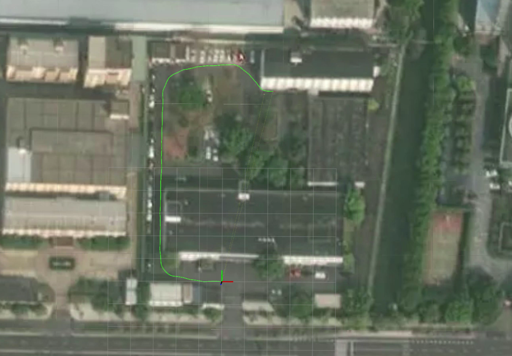

# simple_gnss_localizer
A simple GNSS positioning and display demo

- Use longitude-latitude-altitude(gnss) only, and computing direction information;
- Display positions on the Google Maps;

<div align="center">

</div>

### video
[bilibili tutorial video](https://www.bilibili.com/video/BV1ZL4y1V7QF?spm_id_from=333.337.search-card.all.click)


## Dependency

-[ROS]

-[rviz_satellite](https://github.com/nobleo/rviz_satellite):copy to the catkin_ws,and ```catkin_make -DCATKIN_WITHELIST_PACKAGES="rviz_satellite"```

## Install

Use the following commands to download and compile the package.

```
cd ~/catkin_ws/src
git clone https://github.com/chengwei0427/simple_gnss_localizer.git
cd ..
catkin_make -DCATKIN_WITHELIST_PACKAGES="gnss_localizer"
```

## Other notes

1. adjust the topic
change the topic ```/fix``` to your gnss topic,or use ```remap```

2. check the ```NavSatFix``` status in ```GNSSCallback```

3. after run your bag(contain gps topic), you could get ```first gnss:30.20230164,120.26021482,14.14500000```,change the the param ```ori_lat,ori_lon,ori_alt``` in```run.launch``` and ```ref_point=[30.20230164,120.26021482,14.14500000]``` in ```scripts/path_client_copy.py```

4. reopen the ```run.launch``` and replay your bag.

## Run the package

1. Run the launch file:
```
roslaunch gnss_localizer run.launch
```

2. Play existing bag files:
```
rosbag play your-bag.bag --clock
```

## Acknowledgements
The gnss_localizer is implemented based on Autoware-AI;
Thanks rviz_satellite and Autoware-AI;